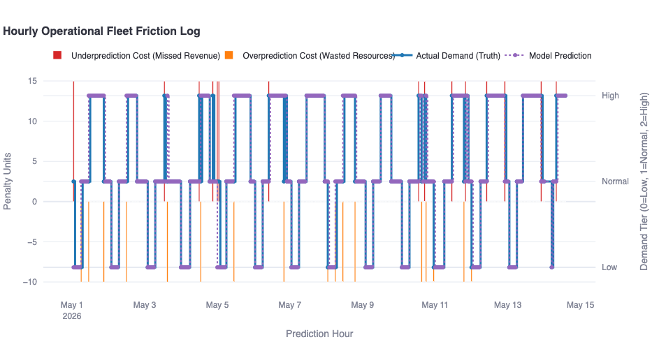
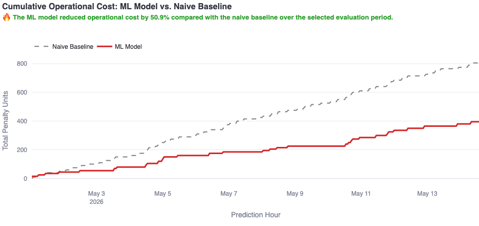

# Ride Demand Prediction Platform (MLOps Sandbox)





This repository orchestrates an end-to-end production-grade MLOps data pipeline. It leverages a multi-layer **Medallion Architecture** integrated with a **Write-Audit-Publish (WAP)** pattern on **Apache Iceberg**, managed via **Apache Airflow**, served via **FastAPI**, and visualized through **Streamlit**.

---

## 🚀 Port Mappings & Web Interfaces

| Service                      | URL                                                      | Authentication     |
| :--------------------------- | :------------------------------------------------------- | :----------------- |
| **Streamlit Dashboard**      | [http://localhost:8501](http://localhost:8501)           | *None*             |
| **Apache Airflow Webserver** | [http://localhost:8080](http://localhost:8080)           | `admin` / `admin`  |
| **Jupyter Notebook**         | [http://localhost:8888](http://localhost:8888)           | Token: `dev_token` |
| **FastAPI Docs**             | [http://localhost:8000/docs](http://localhost:8000/docs) | *None*             |

---

## 🛠️ Getting Started

### Step 1: Spin Up the Platform
```bash
docker compose up -d --build

```

### Step 2: Activate Airflow

1. Navigate to [http://localhost:8080](https://www.google.com/search?q=http://localhost:8080).
2. Toggle all DAGs to **Active** (blue).
3. Trigger the `hello_world` DAG to verify the scheduler is running.

### Step 3: Download Raw Data

```bash
docker exec -it --workdir /opt/airflow jupyter_notebook python /opt/airflow/jobs/download_raw_data.py

```

### Step 4: Seed the Data Lake (Medallion + WAP)

Process all months through the pipeline. The script will automatically skip files already present in `.processed/`.

```bash
bash run_all_months.sh

```

### Step 5: Audit Data Coverage

Verify all months have successfully propagated to the Gold ML observation table.

```bash
docker exec -it --workdir /opt/airflow jupyter_notebook python /opt/airflow/jobs/audit_gold_coverage.py

```

### Step 6: Train the Champion Model

```bash
docker exec -it --workdir /opt/airflow jupyter_notebook python /opt/airflow/jobs/ml_train_pipeline.py

```

### Step 7: Backfill & Deploy

```bash
bash backfill_x_days.sh

```

### Step 8: Evaluate System Performance

Navigate to [http://localhost:8501](https://www.google.com/search?q=http://localhost:8501) to monitor performance diagnostics.

---

## 🔍 Debugging & Troubleshooting

### Pipeline Integrity

If months are missing from the Gold layer, your daemon might have suffered event loss. Ensure the `mock-lambda-watcher` is running (logs: `docker compose logs -f mock-lambda-watcher`). The new queue-based architecture in `sftp_mock_daemon.py` ensures all events are serialized and processed safely.

### Resetting State

If the pipeline enters an inconsistent state, you can perform a full purge:

```bash
docker compose down -v

```

---

## ⚠️ Security Notice

Secrets committed in this repo are for **local sandbox teaching purposes only**. Do not use these in production environments.


### Streamlit app fails or stops working?

Restart it
```
docker compose up -d streamlit
```
